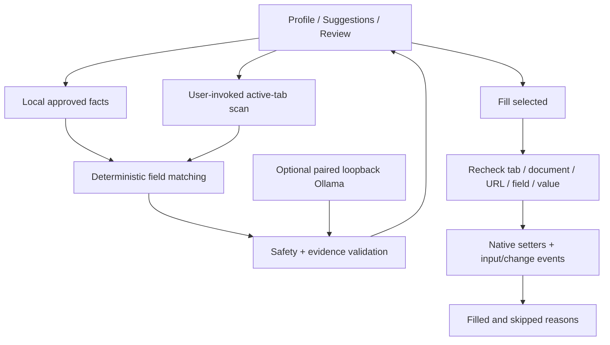

# FormPilot AI

**Your facts. Your final say.** A local-first Chrome/Edge extension that previews sourced answers, lets you edit or deselect them, and fills only after you click **Fill selected**. It never clicks submit.

The default matching engine is deterministic, **not an LLM**. Optional Ollama support can propose mappings for a small set of ambiguous neutral labels. It cannot generate new facts. No account, API key, subscription, or hosted service is required.

## Install the unpacked extension

Requires Node.js 24 and a Chromium browser with the side panel API (Chrome 116+; use a current Chrome or Edge).

```sh
npm ci
npm run check
npm test
npm run build
npm run demo
```

1. Open `chrome://extensions` or `edge://extensions`. Enable **Developer mode**.
2. Choose **Load unpacked** and select this project's `dist` directory.
3. Visit **http://127.0.0.1:4173**. Click the FormPilot extension icon to grant temporary active-tab access and open its side panel. You can pin the icon; `Alt+Shift+F` is also registered unless another shortcut conflicts.
4. Choose **Use fictional sample**, or enter your own approved facts and **Save profile**.
5. **Scan current tab → Review answers → Fill selected**. Review every proposed answer first. Some websites autosave on field changes.

Click the extension action again on each new tab/origin before scanning. Browser settings, extension stores, and other restricted pages cannot be scanned. The HTTP demo requires no file access. To use `demo/index.html` directly as a file, enable **Allow access to file URLs** in the extension's browser settings first.

## A one-minute demo

All sample identity, education, and work details are fictional.

1. Load the demo and the fictional profile. Scan: name, email, phone, city, state, school, education, and work history have sources.
2. Notice the existing preferred name is preserved; portfolio is missing; open-ended questions are left unanswered; sensitive questions and attestations are manual-only.
3. Review, edit the full name, and deselect phone. Click the demo's **Change email label after scan** button.
4. Click **Fill selected**. The changed email field is skipped, phone stays blank, and the other approved fields fill. State selects Oregon by an exact option match.
5. Check the demo's event counters: input/change events occur, and submissions remain zero. The counters simulate observing an autosave event; the demo does not persist answers or send them anywhere.

Actual browser screenshots and verification details are in [`docs/`](docs/). `docs/design-concept.png` is an AI-generated design reference, **not evidence of working functionality**.

### Interface and accessibility

The real side panel includes grouped profile fields, unsaved-change feedback, sourced answer review, per-field results, and nearby error recovery. A local model proposal is labeled separately from an exact match; editing any answer relabels it **Edited by you**. Blank selected answers block filling until corrected or deselected. Deleting or replacing a saved profile requires a cancellable confirmation.

The interface reflows from a narrow extension panel to a bounded two-column workspace. It uses native labeled controls, visible keyboard focus, error announcements, and reduced-motion support. The [project design system](docs/design-system.md) records UI UX Pro Max 2.15.0 installation, actual searches, and which recommendations fit this product. Third-party skill assets stay local and are not shipped with the application. See [verification](docs/verification.md) for screenshots and the limits of accessibility testing.

## Optional local model

The deterministic path works without any server or model. Live inference requires a locally installed [Ollama](https://docs.ollama.com/) model. Downloading a model consumes disk space and bandwidth; this project does not download one automatically.

1. Install/start Ollama and install a local model of your choice (default: `qwen2.5:3b`). Do not choose a cloud model.
2. Copy FormPilot's extension ID from the browser's extensions page.
3. In PowerShell, from this project:

```powershell
$env:FORMPILOT_EXTENSION_ORIGIN = 'chrome-extension://YOUR_EXTENSION_ID'
$env:FORMPILOT_MODEL = 'qwen2.5:3b'
npm run bridge
```

   On macOS/Linux, use `FORMPILOT_EXTENSION_ORIGIN=chrome-extension://YOUR_EXTENSION_ID FORMPILOT_MODEL=qwen2.5:3b npm run bridge`.
4. Under **Profile → Optional local model**, paste the pairing token printed by the bridge, select the specific profile facts that may be sent, and click **Allow local bridge**. Keep that terminal open.
5. Scan and click **Try local model**. Eligible labels are deliberately restricted to `Contact`, `Contact details`, `Location`, and `Professional background`; other unknown questions remain manual. The demo includes Professional background. Model suggestions are unchecked until you explicitly select them.

The bridge binds to `127.0.0.1:3210`, checks the exact extension Origin and Host, requires a random bearer token, limits request size, and forwards only to `127.0.0.1:11434/api/chat`. It rejects cloud-named models. Set up Ollama for local use; FormPilot does not manage your Ollama installation. The model request has an 18-second timeout; the extension has a 20-second timeout. A failed request or invalid output keeps exact matches usable. Stop the terminal to disable the bridge. Remove the optional localhost permission in extension settings if desired.

**Validation:** structured output must contain only field IDs, fact IDs, and unchanged approved fact values. Unknown IDs, duplicates, extra keys, sensitive fields, mismatched values, and nonmatching select options are rejected. This validates evidence, not semantic correctness: users must still review the proposed mapping.

## Privacy and permissions

- Profile facts are stored in `chrome.storage.local` in this browser profile, not synced. FormPilot does **not encrypt** them. Browser/OS access and backups can expose them. Content scripts cannot read the profile store; storage access is restricted to trusted extension contexts.
- Scan metadata, suggestions, pairing tokens, and result state stay in the current panel's memory. Closing/reloading the panel clears them. Values typed into websites belong to those websites; they may autosave or submit in response to events.
- **Delete data** clears extension local/session storage and the current panel. It cannot erase answers already sent to a website or data in other already-open extension views. No model requests are logged by the bridge; Ollama has its own processing/logging behavior.
- No analytics, telemetry, account, remote sync, external fonts, remote scripts, or automatic model calls. Profile facts leave the extension only when filling a website or explicitly asking the paired local model.
- Required permissions: `activeTab` for temporary user-invoked page access, `scripting` to scan/write, `storage` for local facts, and `sidePanel` for the interface. There are no required host permissions or persistent content scripts.
- The optional `http://127.0.0.1/*` host permission is requested only by **Allow local bridge**. Chrome host permissions cannot be limited to one port; the extension's content security policy limits its requests to port 3210.

## Architecture



Small TypeScript modules separate `profile`, `matching`, `safety`, `local-ai`, `page-agent`, and browser orchestration. The compact UI uses native DOM controls and esbuild; no runtime framework is necessary. Text from pages/models is rendered with `textContent`, never interpreted as HTML or instructions.

## Supported behavior and boundaries

- Top-level visible, enabled, editable ordinary text/email/tel/url inputs, textareas, and single selects. Labels include `aria-labelledby`, `aria-label`, associated labels, placeholders, and names. Disabled/read-only/hidden controls and common honeypots are excluded.
- Passwords, codes, financial/government identifiers, immigration/work authorization, demographic/health disclosures, legal declarations, suspicious instruction-like labels, and unsupported controls are manual-only. Unknown labels abstain unless the user has explicitly supplied a matching custom fact. This is a conservative ruleset, not a universal sensitive-content detector; deceptive or unusual wording may escape classification. Review all answers.
- No frame scanning, shadow DOM, custom comboboxes, contenteditable controls, multi-selects, dates, radio buttons, checkboxes, file uploads, CAPTCHAs, or screening-answer generation.
- Fields are held by original DOM identity in the isolated world. Writing rechecks document ID, scan token, URL, label/context, type, options, visibility, editability, form metadata, and existing content. Replaced fields are skipped even when they look identical. Nonempty answers are never overwritten.
- Selects require one exact normalized label/value match. Ordinary native setters plus input/change events support many forms, but some frameworks/custom validators require trusted keystrokes and remain unsupported.
- FormPilot never clicks submit/save/apply/confirmation controls, but **a website can itself react to change events by saving or submitting**. Use only pages where you approve that possibility.
- Closing the panel discards the current review. Rescan after navigation, profile edits, or dynamic form changes. Long forms remain scrollable.

## Verification

```sh
npm run check
npm test
npm run build
npx playwright install chromium
npm run test:browser
npm audit
```

The browser runner loads the **unmodified production build** in isolated Playwright Chromium. It invokes the extension action with Chromium's extension-debugging protocol, then verifies the real extension interface against the local demo. It never adds test host permissions to the manifest. Screenshots are generated from the running interface; consult `docs/verification.md` for precise panel-testing limitations and observed results.

The GitHub Actions workflow runs checks, build, tests, and browser verification and uploads the build/evidence. It has read-only repository permissions. See [Actions runs](https://github.com/minhal-coding/formpilot-ai/actions) for remote results and downloadable build artifacts.

## Official references

[Side panel](https://developer.chrome.com/docs/extensions/reference/api/sidePanel) · [activeTab](https://developer.chrome.com/docs/extensions/develop/concepts/activeTab) · [Scripting](https://developer.chrome.com/docs/extensions/reference/api/scripting) · [Storage](https://developer.chrome.com/docs/extensions/reference/api/storage) · [Ollama chat](https://docs.ollama.com/api/chat) · [Playwright extensions](https://playwright.dev/docs/chrome-extensions)

MIT licensed. This project is not affiliated with Google, Microsoft, or Ollama.
