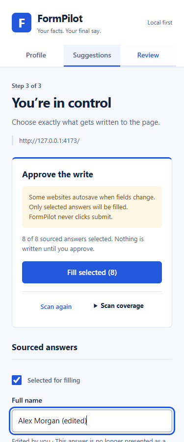
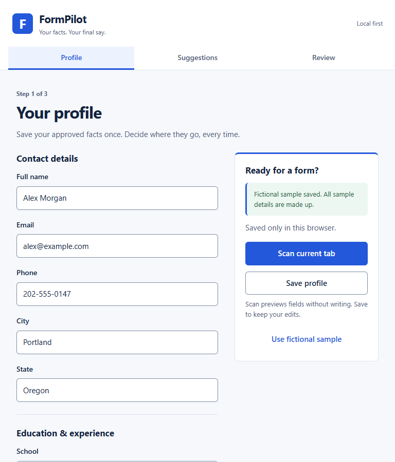
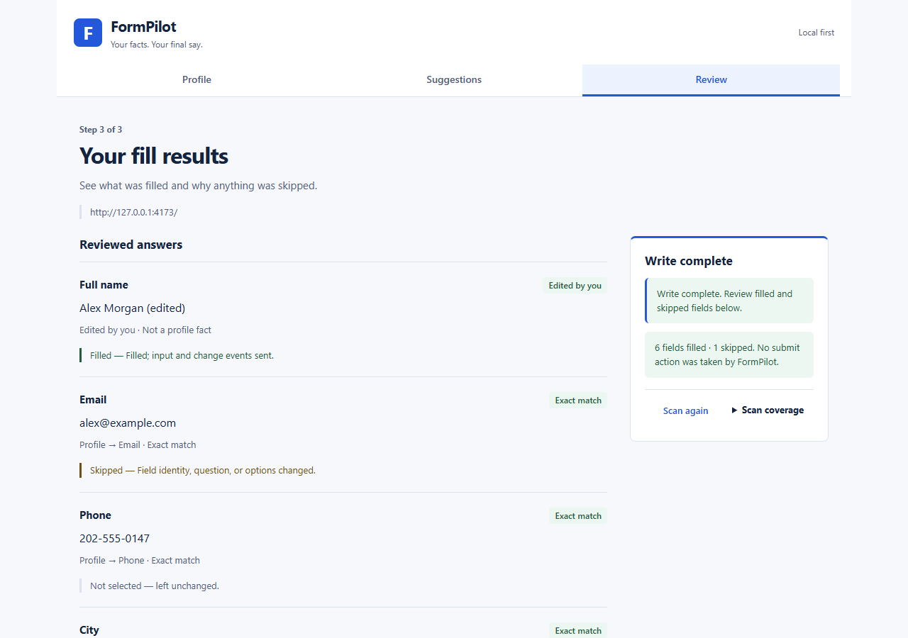

# Verification record

Verified locally on September 23, 2026, on Windows with Node 24.18.0 and Playwright Chromium 153.0.8010.12. Public repository: [minhal-coding/formpilot-ai](https://github.com/minhal-coding/formpilot-ai). It has not been published to the Chrome Web Store.

## Commands and results

| Command | Observed result |
| --- | --- |
| `npm run check` | TypeScript passes |
| `npm test` | 35 tests pass across matching/safety/model validation and bridge boundary tests |
| `npm run build` | Production Manifest V3 extension generated in `dist/` |
| `npx playwright install chromium` | Chromium installed for isolated extension testing |
| `npm run test:browser` | Native side-panel workflow and adversarial checks pass |
| `npm audit` | Zero reported vulnerabilities, including development dependencies |

The browser test uses the **unmodified production manifest** with no added host permissions, then invokes the actual extension action through Chromium's `Extensions.triggerAction`. Playwright does not expose the native side-panel target in its ordinary `pages()` list, so `tests/panel-driver.mjs` attaches through CDP to that actual target. Buttons use pointer events; edits use browser text-input events. The page and extension APIs run in the actual browser, not mocks. The browser is headless; this does not constitute a manual headed Chrome/Edge installation test.

## Main flow

Toolbar action → native panel opens → fictional sample → scan → sourced suggestions → review → edit name → deselect phone → change email question on the page → fill selected → results.

Observed: six fields filled, changed email skipped, phone unchanged, existing preferred name preserved, State = Oregon, sensitive fields blank, attestation unchecked. **6 input events, 6 change/autosave-observation events, 0 submissions.** The extension did not contact a model during this flow.

## Additional browser checks

- Label extraction: associated label, aria-label, aria-labelledby, placeholder, and name fallback.
- Fields replaced by identical DOM clones are skipped.
- A value populated after scanning is preserved.
- Read-only changes, input-type changes, and changed/disabled select options prevent writing.
- URL changes and document reloads prevent stale writes.
- Malicious label instructions and an ordinary label with sensitive described-by context remain manual-only.
- Hidden controls, disabled fieldsets, read-only inputs, and common honeypots are excluded.
- Embedded frames are reported as unsupported.
- Actual local profile edit/save and deletion verified through extension storage.
- Tab key advances through navigation; focus indicators are visible.
- No uncaught runtime exceptions. No horizontal overflow at 380px and 280px widths.

## Findings fixed during the loop

1. Automatic side-panel action behavior opened the panel without granting page access in the test. An explicit `action.onClicked` handler now opens the panel after the toolbar invocation grants `activeTab`.
2. Viewport-relative visibility incorrectly rejected fields above the viewport after scrolling. The visibility check now uses document coordinates while still rejecting hidden/off-document controls.
3. A malformed demo option omitted Oregon from the DOM. Corrected and verified by an actual select fill.
4. Chrome's default extension body font shrank inherited controls. Explicit body font inheritance now keeps 14px controls readable.

## UI UX Pro Max implementation pass

UI UX Pro Max CLI **2.15.0** was installed once, Codex-only, in this project with `npx --yes ui-ux-pro-max-cli@2.15.0 init --ai codex`. The generated `.agents/skills/ui-ux-pro-max/SKILL.md`, actual data/script directories, and Python 3.11.15 search execution were verified. See [design-system.md](design-system.md) for the upstream sources/license, exact searches, fit decisions, and design tokens. The skill directories and caches are ignored locally and are not committed or bundled.

The real extension now has grouped profile fields, unsaved feedback, operation-specific busy states, nearby persistent errors, native profile deletion/replacement dialogs, and distinct exact-match/model/edit evidence labels. Selected blank answers have described inline errors and disable filling. The narrow layout prioritizes review actions while the wide layout puts the same real controls beside the answers. No separate application/demo was substituted for the product interface.

The Browser plugin's `browser` skill is absent in this session. The existing extension-capable Playwright/CDP workflow was used to exercise the actual native side-panel target. All previous security tests were preserved.

| Check | Result |
| --- | --- |
| Page identity / nonblank UI | Correct native extension URL and meaningful Profile/Suggestions/Review content |
| Framework overlay / runtime errors | None observed; vanilla DOM build, no uncaught exceptions or relevant console errors |
| Full flow | Profile → scan → edit/deselect → approve fill → actual results; 6 normal input/change events, 0 submissions |
| Responsive screenshots | Profile, Suggestions, Review, results, empty state, model-setup error at **375×900, 768×900, 1280×900** |
| Narrow regression | 280px: long labels/tokens reflow, no horizontal overflow |
| Error handling | Profile email validation, blank selected answer, missing model setup, changed URL/document, no scanned fields |
| Keyboard | Workflow navigation, invalid-field/error focus, dialog Cancel/Escape and focus return, 16 sequential focused controls wholly visible with an outline |
| Motion | `prefers-reduced-motion: reduce` produces zero transition duration |
| Automated accessibility | axe-core 4.13.0, WCAG 2/2.1/2.2 A/AA tags: **zero violations in 11 tested states** |

Wide screenshots use CDP viewport emulation on the same native side-panel target; they are not separate marketing pages. Automated accessibility checks run primarily at the narrow viewport. They do not certify complete WCAG compliance or substitute for assistive-technology user testing.

Loading verification deliberately delays the real storage call by 1000ms in the test browser, then forwards to actual extension storage. [`loading-fixture.png`](screenshots/loading-fixture.png) is labeled as this controlled-latency fixture, not a claim about a live model/network response. No runtime mock, fixture delay, skill asset, or axe script is included in `dist/`.

Visual findings fixed: secondary actions initially pushed the first answer below the 375px viewport; review controls were compacted and the optional model action moved into a disclosure. Navigation text at 280px was also adjusted to avoid breaking Suggestions across lines. Final viewport images were inspected for hierarchy, readable sources, focus rings, control boundaries, status meaning, and long-text reflow.

Machine-readable reports: [accessibility-results.json](accessibility-results.json), [browser-results.json](browser-results.json).

## Original design reference

The generated [`design-concept.png`](design-concept.png) is the original design reference only. The current implementation is governed by [design-system.md](design-system.md). Actual panel screenshots were captured with CDP from the native extension panel; the demo screenshot was captured with Playwright.

Compared: white background, navy text/blue accent, F mark and header, three-tab navigation, heading hierarchy, field/row spacing, fine dividers, input geometry, visible source captions, autosave warning, and primary buttons. The core visual system is implemented. The reference's incorrect work-authorization suggestion and unrestricted custom-fact examples were deliberately replaced with manual-only handling and safer guidance. Fictional data and required explanatory copy differ from the generated reference. This is not a pixel-identical copy of the mockup.

Viewport checks include 375×900, 768×900, 1280×900, 380×900, and 280×800. Full-page screenshots also show scrollable fields. No clipped labels or overlapping controls were observed in the inspected viewports.

## Optional model status

The adapter's schema/evidence validation, missing-server failure, and bridge forwarding/error paths have automated tests. Ollama responses in bridge integration tests are **fixtures**, not live inference. No live Ollama model inference has been verified. Semantic correctness of optional model mappings remains a user-review responsibility.

## Remaining boundaries

- Current retail Chrome and Edge have not been manually tested. Automated verification used Chromium 153 with extension debugging enabled only in the test browser.
- No cross-origin frames, shadow DOM, custom widgets, or arbitrary screening questions.
- Rule-based sensitive-field detection cannot guarantee recognition of every disguise or language; English matching is the primary supported path.
- A site can autosave or submit in response to normal field events even though FormPilot never invokes a submit action.
- CI is configured; see the repository's [Actions runs](https://github.com/minhal-coding/formpilot-ai/actions) for current remote results.

## Actual screenshots

Additional states: [model setup error](screenshots/model-setup-error-375.png), [inline validation](screenshots/profile-validation.png), [delete confirmation](screenshots/delete-confirmation.png), [local model settings](screenshots/model-settings.png), [no fields](screenshots/no-fields.png), [long labels](screenshots/long-label.png), [empty](screenshots/empty-375.png).

Full-page evidence: [profile](screenshots/profile.png), [suggestions](screenshots/suggestions.png), [review](screenshots/review.png), [results](screenshots/results.png), [narrow results](screenshots/narrow.png), [filled demo](screenshots/filled-demo.png). Machine-readable primary-flow results: [`browser-results.json`](browser-results.json).
