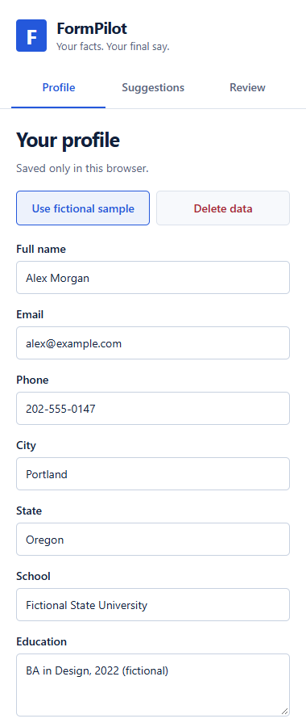
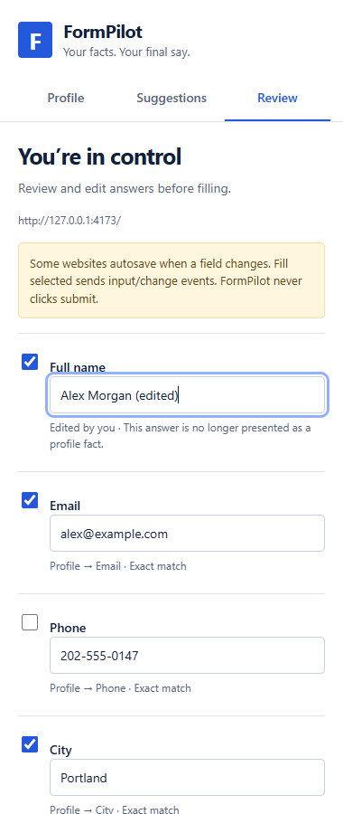
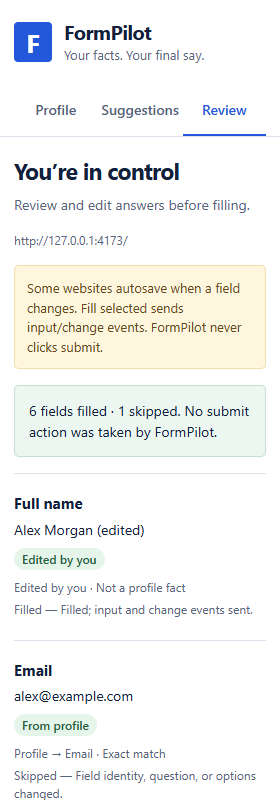

# Verification record

Verified locally on September 23, 2026, on Windows with Node 24.18.0 and Playwright Chromium 153.0.8010.12. Public repository: [minhal-coding/formpilot-ai](https://github.com/minhal-coding/formpilot-ai). It has not been published to the Chrome Web Store.

## Commands and results

| Command | Observed result |
| --- | --- |
| `npm run check` | TypeScript passes |
| `npm test` | 35 tests pass across matching/safety/model validation and bridge boundary tests |
| `npm run build` | Production Manifest V3 extension generated in `dist/` |
| `npx playwright install chromium` | Chromium installed for isolated extension testing |
| `npm run test:browser` | Native side-panel workflow and adversarial checks pass |
| `npm audit` | Zero reported vulnerabilities, including development dependencies |

The browser test uses the **unmodified production manifest** with no added host permissions, then invokes the actual extension action through Chromium's `Extensions.triggerAction`. Playwright does not expose the native side-panel target in its ordinary `pages()` list, so `tests/panel-driver.mjs` attaches through CDP to that actual target. Buttons use pointer events; edits use browser text-input events. The page and extension APIs run in the actual browser, not mocks. The browser is headless; this does not constitute a manual headed Chrome/Edge installation test.

## Main flow

Toolbar action → native panel opens → fictional sample → scan → sourced suggestions → review → edit name → deselect phone → change email question on the page → fill selected → results.

Observed: six fields filled, changed email skipped, phone unchanged, existing preferred name preserved, State = Oregon, sensitive fields blank, attestation unchecked. **6 input events, 6 change/autosave-observation events, 0 submissions.** The extension did not contact a model during this flow.

## Additional browser checks

- Label extraction: associated label, aria-label, aria-labelledby, placeholder, and name fallback.
- Fields replaced by identical DOM clones are skipped.
- A value populated after scanning is preserved.
- Read-only changes, input-type changes, and changed/disabled select options prevent writing.
- URL changes and document reloads prevent stale writes.
- Malicious label instructions and an ordinary label with sensitive described-by context remain manual-only.
- Hidden controls, disabled fieldsets, read-only inputs, and common honeypots are excluded.
- Embedded frames are reported as unsupported.
- Actual local profile edit/save and deletion verified through extension storage.
- Tab key advances through navigation; focus indicators are visible.
- No uncaught runtime exceptions. No horizontal overflow at 380px and 280px widths.

## Findings fixed during the loop

1. Automatic side-panel action behavior opened the panel without granting page access in the test. An explicit `action.onClicked` handler now opens the panel after the toolbar invocation grants `activeTab`.
2. Viewport-relative visibility incorrectly rejected fields above the viewport after scrolling. The visibility check now uses document coordinates while still rejecting hidden/off-document controls.
3. A malformed demo option omitted Oregon from the DOM. Corrected and verified by an actual select fill.
4. Chrome's default extension body font shrank inherited controls. Explicit body font inheritance now keeps 14px controls readable.

## Design inspection

The generated [`design-concept.png`](design-concept.png) is a design reference only. The actual panel screenshots below were captured with CDP from the native extension panel; the demo screenshot was captured with Playwright. Both the reference and final viewport screenshots were visually inspected.

Compared: white background, navy text/blue accent, F mark and header, three-tab navigation, heading hierarchy, field/row spacing, fine dividers, input geometry, visible source captions, autosave warning, and primary buttons. The core visual system is implemented. The reference's incorrect work-authorization suggestion and unrestricted custom-fact examples were deliberately replaced with manual-only handling and safer guidance. Fictional data and required explanatory copy differ from the generated reference. This is not a pixel-identical copy of the mockup.

Native-size viewport checks: 380×900 and 280×800. Full-page screenshots also show all scrollable fields. No clipped labels or overlapping controls were observed in the inspected viewports.

## Optional model status

The adapter's schema/evidence validation, missing-server failure, and bridge forwarding/error paths have automated tests. Ollama responses in bridge integration tests are **fixtures**, not live inference. No live Ollama model inference has been verified. Semantic correctness of optional model mappings remains a user-review responsibility.

## Remaining boundaries

- Current retail Chrome and Edge have not been manually tested. Automated verification used Chromium 153 with extension debugging enabled only in the test browser.
- No cross-origin frames, shadow DOM, custom widgets, or arbitrary screening questions.
- Rule-based sensitive-field detection cannot guarantee recognition of every disguise or language; English matching is the primary supported path.
- A site can autosave or submit in response to normal field events even though FormPilot never invokes a submit action.
- CI is configured; see the repository's [Actions runs](https://github.com/minhal-coding/formpilot-ai/actions) for current remote results.

## Actual screenshots

Full-page evidence: [profile](screenshots/profile.png), [suggestions](screenshots/suggestions.png), [review](screenshots/review.png), [results](screenshots/results.png), [narrow results](screenshots/narrow.png), [filled demo](screenshots/filled-demo.png). Machine-readable primary-flow results: [`browser-results.json`](browser-results.json).
